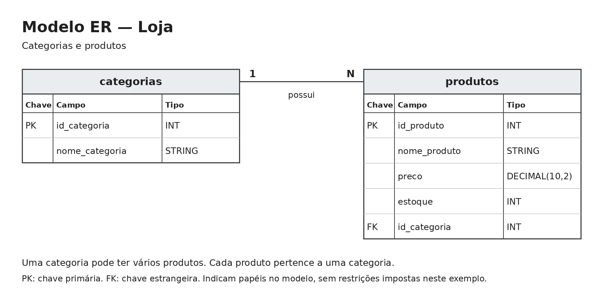

# Delta Lake e Apache Iceberg com PySpark

Trabalho de Engenharia de Dados que demonstra a criação de tabelas e as operações INSERT, UPDATE e DELETE nos formatos Delta Lake e Apache Iceberg.

## Participante

- Yasmin Bez Fontana

## Cenário e dados

O exemplo representa uma loja com duas tabelas: `categorias` e `produtos`. Uma categoria pode possuir vários produtos, e cada produto pertence a uma categoria.

O conjunto de dados foi criado para o trabalho e contém duas categorias, Informática e Papelaria, e dez produtos fictícios. Os registros são inseridos diretamente por comandos SQL nos dois notebooks.



Os identificadores representam os papéis de chave no modelo. As tabelas do exemplo não possuem restrições de chave primária ou estrangeira.

## Ambiente e versões

O projeto utiliza um único ambiente Python, gerenciado com UV, para os dois notebooks e a documentação.

| Ferramenta ou biblioteca | Versão utilizada |
|---|---|
| Python | 3.11.9 |
| Java | OpenJDK 17.0.20.1 |
| UV | 0.12.21 |
| PySpark | 3.5.3 |
| delta-spark | 3.2.0 |
| Apache Iceberg | 1.6.1 |
| JupyterLab | 4.6.4 |
| ipykernel | 7.4.0 |
| MkDocs | 1.6.1 |

As dependências Python estão declaradas no `pyproject.toml`. O `uv.lock` registra as versões resolvidas, e o `.python-version` indica a versão do Python utilizada.

O suporte Java ao Delta e ao Iceberg é carregado pela configuração `spark.jars.packages` nos notebooks. Na primeira execução, é necessário acesso à internet para baixar esses componentes.

## Instalação

Execute os comandos em um terminal Ubuntu, incluindo Ubuntu no WSL.

### 1. Instalar os pré-requisitos

```bash
sudo apt update
sudo apt install openjdk-17-jre-headless git curl
```

Instale o UV pelo instalador oficial:

```bash
curl -LsSf https://astral.sh/uv/install.sh | sh
```

Reabra o terminal após a instalação e confira:

```bash
java -version
uv --version
git --version
```

### 2. Baixar o projeto

```bash
git clone https://github.com/bfontanayasmin/trabalhoBancodeDados.git
cd trabalhoBancodeDados
```

### 3. Preparar o ambiente Python

```bash
uv python install 3.11.9
uv sync --locked
```

O comando `uv sync --locked` cria o ambiente `.venv` e instala as dependências conforme o arquivo de versões do projeto.

## Executar os notebooks

Na pasta principal do projeto, execute:

```bash
uv run jupyter lab
```

Abra o endereço informado no terminal e entre na pasta `notebooks`.

| Notebook | Conteúdo |
|---|---|
| `delta_lake.ipynb` | Cenário, modelo ER, DDL e operações em Delta Lake. |
| `iceberg.ipynb` | Mesmo cenário e operações em Apache Iceberg. |

Em cada notebook, use **Kernel → Restart Kernel and Run All Cells** para executar as células em ordem. Execute um notebook por vez e desligue seu kernel antes de executar o outro.

A célula inicial de limpeza remove as tabelas e os arquivos do exemplo anterior. Ao executar o notebook completo, os registros são criados novamente. Os arquivos gerados ficam em `data/delta` ou `data/iceberg`.

### Resultados esperados

| Operação | Resultado |
|---|---|
| INSERT | Duas categorias e dez produtos cadastrados. |
| UPDATE | Mouse com preço de R$ 59,90 e estoque de 15 unidades. |
| DELETE | Caneta removida; nove produtos permanecem na tabela. |

As consultas antes e depois de cada operação mostram os resultados.

## Documentação com MkDocs

A documentação é organizada em quatro páginas: contextualização do trabalho, Apache Spark/PySpark, Apache Iceberg e Delta Lake.

Para visualizar a documentação localmente, execute na pasta principal:

```bash
uv run mkdocs serve
```

Abra o endereço exibido no terminal, normalmente `http://127.0.0.1:8000`.

Para verificar a geração do site:

```bash
uv run mkdocs build --strict
```

Para publicar no GitHub Pages, com autenticação e permissão de escrita no repositório:

```bash
uv run mkdocs gh-deploy
```

O comando publica os arquivos gerados na branch `gh-pages`. Nas configurações de Pages do repositório, selecione essa branch e a pasta raiz `/` como origem da publicação.

## Referências

- [UV](https://docs.astral.sh/uv/)
- [Apache Spark](https://spark.apache.org/docs/3.5.3/)
- [Delta Lake](https://docs.delta.io/)
- [Apache Iceberg](https://iceberg.apache.org/)
- [MkDocs](https://www.mkdocs.org/)

## Documentação publicada

As quatro páginas da documentação estão disponíveis em:
https://bfontanayasmin.github.io/trabalhoBancodeDados/
